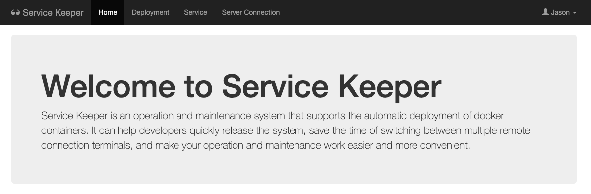
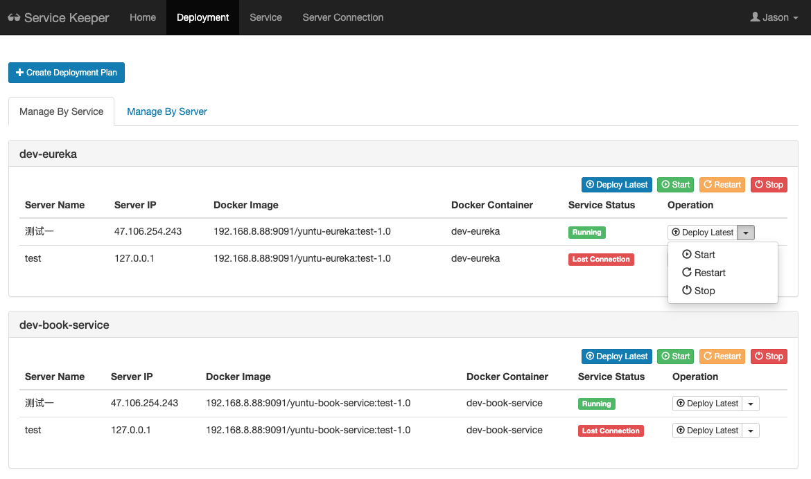

# Service Keeper(TBD)

> Service Keeper is an operation and maintenance system that supports the automatic deployment of docker containers. 
> It can help developers quickly release the system, save the time of switching between multiple remote connection terminals,
> and make your operation and maintenance work easier and more convenient.

## Deployment

### Create Deployment Plan

### Manage By Service

### Manage By Server

## Servicve Maintain

### Create Service

### Edit Service

## Server Connection Maintain 

### Create Server Connection

### Edit Server Connection
